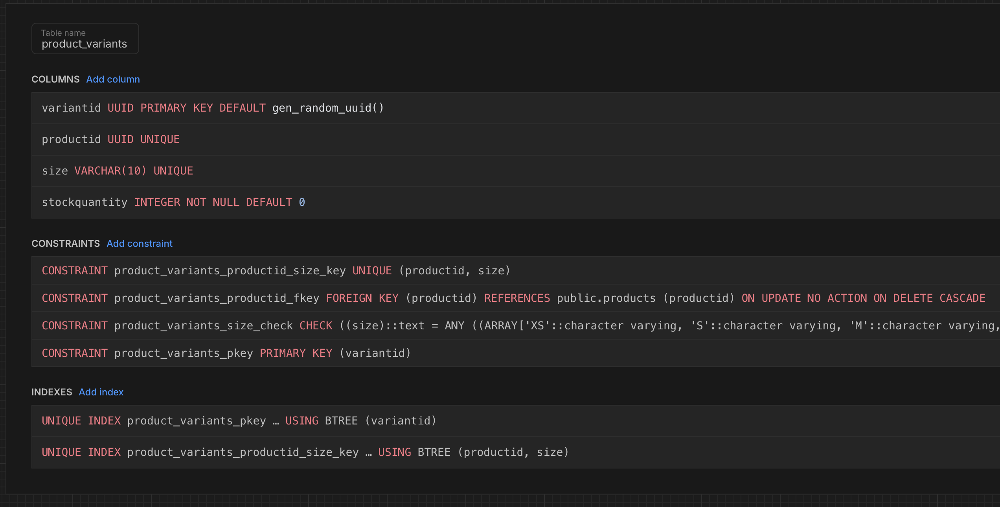

# Kloth
### Database Design
__Products Table__

_Storing colors column in Products table because each row/product has 1 color variation only, there are no duplicates of the same product in a different color.  A product can fall under different shades of colors hence the array of colors such as ['cream', 'brown']_

_Primary key : productid (autogenerated uuid)_

__Product Variants Table__

_The product_variant table is used to keep track of the different sizes a product has available and how much stock there is respective to a specific size_

_Primary Key : variantid (auto generated uuid)_

_Foreign Key : productid (references to specific product row from Products table)_

__Popular Table__

_Primary Key: popularid(auto genereated uuid)_

_Foreign Key: productid(refers to productid column in product table)_

